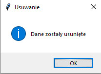

## ismed2022Z_Pietrucha

# Fuzja obrazów PET i CT
Do uruchomienia progamu potrzebne jest zainstalowanie bibliotek wpisanych w requirements.txt

Po uruchomieniu programu powino wyskoczyć jego okno:

Przycisk CT służy do wczytania tego rodzaju zdjęc, analogiczną funckję ma przycisk PET
Po wcisnięciu każdego z nich pojawi się okno dialogowe do wyboru foldera, z którego mają pochodzić
odpowiednie zdjęcia:

Wgranie plików zostanie oznajmione odpowiednim komunikatem.
Ponowna próba wczytania zdjęć zakończy się niepowodzeniem oraz wyświetleniem odpowiedniego komunikatu.
Kiedy mamy wgrane do programu zdjęcia PET i CT możemy przystąpić do fuzji klikając przcisk Fusion.
Kiedy fuzja się zakończy zostanie wyświetlony odpowiedni komunikat:

Zdjęcie pojawi się dopiero po przesunięciu suwaka, kolejne warstwy zmieniamy również tym samym suwakiem.

Po przejrzeniu zdjęć, żeby załadować kolejne należy przycisnąć przycisk DELETE, który usunie pamięć programu 
i pojawi się odpowiedni komunikat

